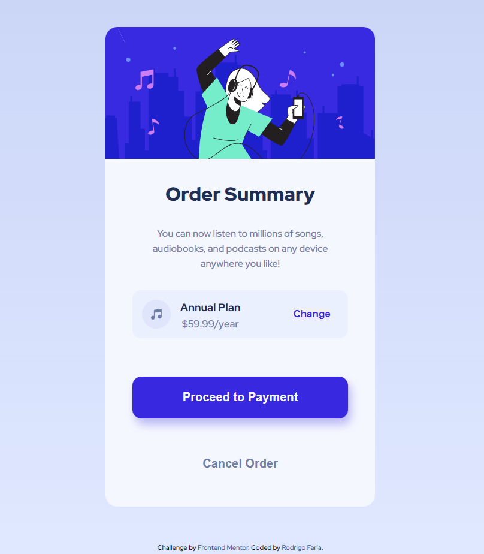

# Frontend Mentor - Order summary card solution

This is a solution to the [Order summary card challenge on Frontend Mentor](https://www.frontendmentor.io/challenges/order-summary-component-QlPmajDUj). Frontend Mentor challenges help you improve your coding skills by building realistic projects. 

# Frontend Mentor - Order summary card solution

### Order summary 

### Links

- URL: [Order summary ](https://rodrigo-fn.github.io/order-summary-component-main/)

## My process

### Built with

- Semantic HTML5 markup
- CSS custom properties
- Flexbox
- Mobile-first workflow

### What I learned

I learned how to develop a page with grid, flex, mobile-first and much more about CSS3 and HTML5

### Continued development

I'm focused on mastering HTML5, CSS3 JavaScript and React technologies.

## Author

- LinkedIn - [Rodrigo Faria](https://www.linkedin.com/in/rodrigo-faria-000790263/)
- Instagram - [@rodrigo.faria19](https://www.instagram.com/rodrigo.faria19/)
- Twitter - [@rodrygo1911](https://twitter.com/rodrygo1911)

## Acknowledgments
Thanks to Frontend Mentor for the challenges.

